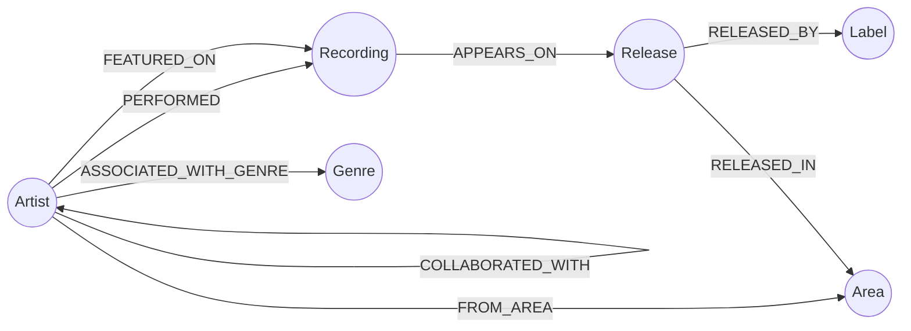

# MusicGraph

Exploration des collaborations musicales à partir de l'API [MusicBrainz](https://musicbrainz.org/doc/MusicBrainz_API), stockées et interrogées dans un graphe [Neo4j](https://neo4j.com/).

Projet **B3 Dev & Data** : construire une application complète (API + base de données + interface web) permettant de rechercher des artistes, importer leurs morceaux/albums/collaborations, et explorer le réseau de collaborations qui en résulte (qui a joué avec qui, sur quels titres, quels genres dominent, etc.).

## Sommaire

- [Le sujet](#le-sujet)
- [Stack technique](#stack-technique--pourquoi)
- [Modèle de données](#modèle-de-données)
- [Structure du repo](#structure-du-repo)
- [Démarrage rapide](#démarrage-rapide-docker-compose)
- [Utilisation](#utilisation)
- [Limitations connues](#limitations-connues)
- [Auteurs](#auteurs)

## Le sujet

L'objectif est de modéliser un problème naturellement **relationnel en graphe** — "quels artistes ont collaboré, sur quels morceaux, dans quels genres" — avec une base NoSQL adaptée (Neo4j) plutôt qu'avec des jointures SQL classiques. Concrètement, l'application doit permettre de :

- rechercher un artiste via l'API publique MusicBrainz ;
- importer cet artiste (et ses morceaux, releases, collaborateurs détectés) dans Neo4j, sans jamais créer de doublon ;
- afficher sa fiche, ses morceaux, ses albums et ses collaborations ;
- visualiser le graphe de collaborations entre artistes ;
- produire des statistiques d'analyse (artistes les plus connectés, top collaborations, genres dominants, morceaux qui relient le plus d'artistes différents).

## Stack technique & pourquoi

### Backend — `back/`

| Techno | Rôle | Pourquoi |
|---|---|---|
| **Python 3.12 + FastAPI** | API HTTP | Async natif (utile pour enchaîner appels MusicBrainz + requêtes Neo4j sans bloquer), validation automatique via Pydantic, documentation interactive générée gratuitement (`/docs`) |
| **Neo4j 5 (Community)** | Base de données | Imposé par le sujet — et surtout le bon outil ici : "qui a collaboré avec qui" est un problème de graphe (chemins, comptage de connexions, détection de motifs), beaucoup plus naturel en Cypher qu'en SQL avec des jointures récursives |
| Driver `neo4j` officiel | Accès base | Pas d'ORM : requêtes Cypher explicites et commentées dans chaque service — l'objectif pédagogique du module NoSQL est justement de manipuler le langage de requête du graphe, pas de l'abstraire |
| **httpx** + **tenacity** | Client MusicBrainz | Client HTTP async avec retry automatique — l'API MusicBrainz est limitée à 1 requête/seconde et répond parfois `503` sous charge, tenacity gère le ré-essai sans complexifier le code métier |
| **uv** | Gestion des dépendances | Résolution et installation rapides, lockfile reproductible (`uv.lock`), remplace pip/poetry |
| **pydantic-settings** | Configuration | Centralise toute la config dans les variables d'environnement — aucun secret en dur dans le code |

### Frontend — `frontend/`

| Techno | Rôle | Pourquoi |
|---|---|---|
| **React 19 + Vite** | SPA | Démarrage et hot-reload quasi instantanés en dev, build de prod optimisé |
| **Tailwind CSS v4** | Styling | Utilitaire, zéro CSS mort, aucun JS supplémentaire au runtime (contrairement à une lib de composants type MUI) |
| **react-router-dom** | Routing client | Standard, léger, gère les routes dynamiques (`/artists/:id`) |
| **d3-force** (+ `d3-selection`/`drag`/`zoom`) | Graphe de collaborations | Layout force-directed = la représentation standard pour un réseau de nœuds/arêtes ; utiliser les modules d3 séparément (plutôt que `d3` complet ou une lib "tout-en-un" comme Cytoscape) garde le bundle léger |
| **Recharts** | Graphiques (page Stats) | Basé sur D3 + composants React idiomatiques, cohérent avec le choix de d3-force |
| **lucide-react** | Icônes | SVG, accessibles, pas d'émoji utilisé comme icône structurelle |

Le routing charge chaque page en lazy (`React.lazy`) : les dépendances lourdes (d3-force, Recharts) ne sont téléchargées que si on visite réellement le Graphe ou les Stats — les autres pages restent très légères.

### Infra

**Docker Compose** orchestre les 3 services (Neo4j, API, frontend) avec une seule commande — imposé par le sujet, et ça évite le classique "ça marche sur ma machine".

## Modèle de données



| Nœud | Propriétés principales |
|---|---|
| `Artist` | `mbid` (unique), `name`, `type`, `country`, `gender`, `beginDate`, `endDate`, `disambiguation` |
| `Recording` | `mbid` (unique), `title`, `length`, `firstReleaseDate` |
| `Release` | `mbid` (unique), `title`, `date`, `country`, `status`, `releaseType` |
| `Label` | `mbid` (unique), `name`, `country` |
| `Genre` | `name` |
| `Area` | `mbid` (unique), `name`, `type` |

Tous les nœuds ont une **contrainte d'unicité sur `mbid`** (créée automatiquement au démarrage de l'API) : réimporter un artiste ne crée jamais de doublon, seulement des `MERGE`. `COLLABORATED_WITH` est détectée via les `artist-credit` MusicBrainz (liste des artistes crédités sur un même morceau) — plus fiable qu'un simple pattern-matching sur les titres (`feat.`, `ft.`...).

Documentation détaillée : [`back/docs/data-model.md`](back/docs/data-model.md) (schéma complet, requêtes clés) · [`back/docs/technical-choices.md`](back/docs/technical-choices.md) (choix techniques justifiés) · [`back/docs/data-analysis.md`](back/docs/data-analysis.md) (méthodologie d'analyse et limites).

## Structure du repo

```
.
├── back/                   # API FastAPI
│   ├── api/app/
│   │   ├── main.py          # point d'entrée FastAPI
│   │   ├── database.py      # connexion Neo4j
│   │   ├── musicbrainz_client.py
│   │   ├── routers/         # endpoints HTTP
│   │   └── services/        # requêtes Cypher / logique métier
│   ├── Dockerfile
│   └── README.md            # détail des endpoints, exemples curl
├── frontend/                # SPA React
│   ├── src/
│   │   ├── api/              # client HTTP + mocks de démo
│   │   ├── components/
│   │   ├── pages/
│   │   └── hooks/
│   └── Dockerfile
├── docker-compose.yml        # neo4j + api + frontend
├── .env.example
└── README.md                 # ce fichier
```

## Démarrage rapide (Docker Compose)

Prérequis : Docker + Docker Compose.

```bash
cp .env.example .env
# édite .env si besoin (mot de passe Neo4j, User-Agent MusicBrainz...)

docker compose up --build
```

- **Frontend** : http://localhost:5173
- **API** : http://localhost:8000 — documentation interactive sur `/docs`
- **Neo4j Browser** : http://localhost:7474 (login `neo4j` / mot de passe défini dans `.env`)

Les deux services `api` et `frontend` montent le code source en volume : toute modification est prise en compte à chaud (hot-reload Vite côté front, `--reload` uvicorn côté back), pas besoin de rebuild à chaque changement.

### Sans Docker

Backend et frontend peuvent aussi tourner nativement (utile pour développer/déboguer un seul des deux) :

- **Backend** : voir [back/README.md](back/README.md) (setup avec [uv](https://docs.astral.sh/uv/)).
- **Frontend** :
  ```bash
  cd frontend
  cp .env.example .env   # VITE_API_BASE_URL doit pointer vers l'API (localhost:8000/api par défaut)
  npm install
  npm run dev
  ```
  Le frontend peut aussi tourner **sans backend** en mettant `VITE_USE_MOCKS=true` dans `frontend/.env` : il utilise alors un jeu de données de démonstration intégré (utile en cas de coupure réseau ou pour une démo hors-ligne).

## Utilisation

1. Aller sur **Rechercher**, taper un nom d'artiste (interroge MusicBrainz en direct — l'artiste n'est pas encore forcément en base).
2. Cliquer sur un résultat. S'il n'est pas encore importé, un bouton **Importer depuis MusicBrainz** propose de le rapatrier (artiste + morceaux + releases + collaborations détectées) dans Neo4j.
3. Une fois importé, explorer sa fiche, la liste **Morceaux**, le **Graphe** des collaborations (glisser-déposer, zoom, clic pour naviguer) et les **Stats** (artistes les plus connectés, top collaborations, genres dominants, morceaux "ponts").

Endpoints principaux de l'API (liste complète et testable sur `/docs`) :

| Méthode | Endpoint | Description |
|---|---|---|
| GET | `/api/search/artists?q=...` | Recherche MusicBrainz en direct |
| POST | `/api/import/artists` | Importe un artiste dans Neo4j |
| GET | `/api/artists`, `/api/artists/{id}`, `/{id}/recordings`, `/{id}/releases`, `/{id}/collaborations` | Lecture des artistes importés |
| GET | `/api/graph/collaborations` | Données du graphe de collaborations |
| GET | `/api/stats/overview`, `/top-artists`, `/top-collaborations`, `/top-genres`, `/top-bridge-recordings` | Analyse |

## Limitations connues

- **Rate limiting MusicBrainz** : l'API publique [limite à ~1 requête/seconde par IP](https://musicbrainz.org/doc/MusicBrainz_API/Rate_Limiting) et pénalise les rafales (pas seulement la moyenne). L'app respecte déjà cette limite (throttle intégré + User-Agent identifié), mais si l'IP a été mise en pénalité (ex. par des tests manuels répétés en dehors de l'app), la recherche/l'import peuvent échouer (`503`/erreurs de connexion) le temps que le débit redescende — voir [back/docs/data-analysis.md#limites](back/docs/data-analysis.md#limites) pour le diagnostic complet. Le backend ré-essaie automatiquement (3 tentatives, échec en ~18s max), et le frontend affiche un message d'erreur clair avec un bouton **Réessayer** plutôt qu'un chargement infini.
- **Débit d'import** : même en dehors de toute pénalité, MusicBrainz limite à ~1 requête/seconde ; importer un artiste avec beaucoup de morceaux/releases peut donc prendre plusieurs secondes (comportement attendu, pas un bug).
- **Ne jamais tester MusicBrainz manuellement en boucle rapide** (scripts, `curl` répétés en dehors de l'app) — ça consomme le même quota et peut déclencher la pénalité pour tout le monde sur le projet.

## Auteurs

- [Julien Dante](https://github.com/Juliendnte)
- [Kantin Fagniart](https://github.com/KANTIN-FAGN)
- [Nathanael Pivot](https://github.com/NathanaelPivot)
