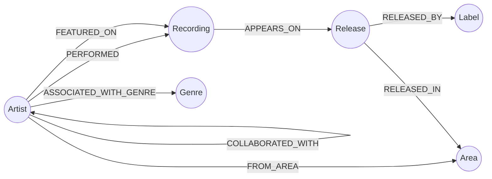

# Modèle de données

MusicGraph modélise l'écosystème musical comme un **graphe de propriétés** dans Neo4j : les entités (artistes, morceaux, albums...) sont des nœuds, et leurs relations (a interprété, apparaît sur, a collaboré avec...) sont des arêtes typées et orientées. Ce document décrit le schéma tel qu'implémenté dans [`back/api/app/`](../api/app), pas seulement tel qu'imaginé sur le papier.

## Vue d'ensemble



## Nœuds

### `Artist`

| Propriété | Type | Toujours présent ? | Source |
|---|---|---|---|
| `mbid` | string | oui (clé) | identifiant MusicBrainz de l'artiste |
| `name` | string | oui | |
| `type` | string | non | `Person` / `Group` / ... |
| `country` | string | non | code pays ISO (`FR`, `US`...) |
| `gender` | string | non | uniquement pour `type=Person` |
| `beginDate` | string | non | date de formation / naissance |
| `endDate` | string | non | date de séparation / décès |
| `disambiguation` | string | non | précision MusicBrainz (ex. "French electronic duo") |

**Nœuds "stub"** : un artiste crédité comme featuring sur un morceau (`FEATURED_ON`) mais jamais importé explicitement via `POST /api/import/artists` n'existe en base qu'avec `mbid` + `name` — les autres propriétés sont absentes tant qu'il n'a pas été importé à son tour (voir [`import_service._link_featured_and_collaboration`](../api/app/services/import_service.py)). C'est voulu : ça permet de détecter et representer la collaboration sans devoir importer en cascade tout le réseau d'un coup.

### `Recording` (morceau)

| Propriété | Type | Notes |
|---|---|---|
| `mbid` | string | clé |
| `title` | string | |
| `length` | int | durée en millisecondes, peut être absent |
| `firstReleaseDate` | string | |
| `source` | string | toujours `"musicbrainz"` |

### `Release` (album / single)

| Propriété | Type | Notes |
|---|---|---|
| `mbid` | string | clé |
| `title` | string | |
| `date` | string | |
| `country` | string | |
| `status` | string | `Official`, `Bootleg`... |
| `releaseType` | string | `Album`, `Single`, `EP`... (déduit du `release-group` MusicBrainz) |

### `Label`, `Genre`, `Area`

Nœuds de support, créés à la volée pendant l'import (jamais importés directement) :

- `Label { mbid, name, country }` — maison de disques d'une release.
- `Genre { name }` — un genre musical peut être partagé par plusieurs artistes ; modélisé comme nœud (pas une simple liste sur `Artist`) pour permettre `MATCH (a:Artist)-[:ASSOCIATED_WITH_GENRE]->(g:Genre)<-[:ASSOCIATED_WITH_GENRE]-(other)` et calculer facilement des stats par genre.
- `Area { mbid, name, type }` — zone géographique (pays, ville...) MusicBrainz.

## Relations

| Relation | Sens | Créée quand |
|---|---|---|
| `(:Artist)-[:PERFORMED]->(:Recording)` | artiste principal | l'artiste importé est crédité sur le morceau |
| `(:Artist)-[:FEATURED_ON]->(:Recording)` | invité | un autre artiste-crédit est détecté sur le morceau (`feat.`, `&`, `x`...) |
| `(:Artist)-[:COLLABORATED_WITH]->(:Artist)` | **bidirectionnelle** | dès qu'un featuring est détecté (voir ci-dessous) |
| `(:Recording)-[:APPEARS_ON]->(:Release)` | | le morceau fait partie de l'album/single importé |
| `(:Release)-[:RELEASED_BY]->(:Label)` | | |
| `(:Artist)-[:ASSOCIATED_WITH_GENRE]->(:Genre)` | | genres/tags de l'artiste sur MusicBrainz |
| `(:Artist)-[:FROM_AREA]->(:Area)` | | zone d'origine de l'artiste |
| `(:Release)-[:RELEASED_IN]->(:Area)` | | *(prévue par le sujet, pas encore peuplée par l'import actuel)* |

### Pourquoi `COLLABORATED_WITH` est bidirectionnelle

Chaque collaboration crée **deux relations** (`A→B` et `B→A`), pas une seule relation non-orientée (Neo4j n'a pas de relation non-orientée native). Conséquence directe à connaître pour quiconque écrit une requête sur ce type de relation : un `MATCH (a)-[:COLLABORATED_WITH]->(b) RETURN a, b` renvoie **chaque paire deux fois** (une fois dans chaque sens). Les endpoints d'agrégation (`/api/stats/top-collaborations`) filtrent ce doublon avec `WHERE a1.mbid < a2.mbid`, et le frontend dé-doublonne aussi côté client avant d'afficher le graphe (clé de paire triée, voir `GraphPage.jsx`).

### Détection des collaborations

Une collaboration est détectée à partir de l'`artist-credit` MusicBrainz d'un morceau — la liste structurée des artistes crédités que renvoie l'API (ex. `["Daft Punk", "feat.", "Pharrell Williams"]`), pas par pattern-matching sur le titre. C'est plus fiable : un featuring peut être écrit `feat.`, `ft.`, `&`, `x`, ou ne rien afficher du tout dans le titre, mais l'`artist-credit` est toujours structuré côté MusicBrainz.

## Contraintes d'unicité

Créées automatiquement au démarrage de l'API ([`database.py`](../api/app/database.py)) :

```cypher
CREATE CONSTRAINT artist_mbid    IF NOT EXISTS FOR (a:Artist)    REQUIRE a.mbid IS UNIQUE
CREATE CONSTRAINT recording_mbid IF NOT EXISTS FOR (r:Recording) REQUIRE r.mbid IS UNIQUE
CREATE CONSTRAINT release_mbid   IF NOT EXISTS FOR (r:Release)   REQUIRE r.mbid IS UNIQUE
CREATE CONSTRAINT label_mbid     IF NOT EXISTS FOR (l:Label)     REQUIRE l.mbid IS UNIQUE
CREATE CONSTRAINT genre_name     IF NOT EXISTS FOR (g:Genre)     REQUIRE g.name IS UNIQUE
CREATE CONSTRAINT area_mbid      IF NOT EXISTS FOR (a:Area)      REQUIRE a.mbid IS UNIQUE
```

Toutes les écritures utilisent `MERGE` (jamais `CREATE` seul) sur ces clés : réimporter le même artiste met à jour ses propriétés sans jamais dupliquer le nœud.

## Exemples de requêtes

**Morceaux d'un artiste (principal ou invité)** :
```cypher
MATCH (a:Artist {mbid: $mbid})-[rel:PERFORMED|FEATURED_ON]->(r:Recording)
RETURN r { .*, role: type(rel) } AS recording
```

**Collaborateurs d'un artiste, avec les morceaux partagés** :
```cypher
MATCH (a:Artist {mbid: $mbid})-[:COLLABORATED_WITH]->(other:Artist)
MATCH (a)-[:PERFORMED|FEATURED_ON]->(shared:Recording)<-[:PERFORMED|FEATURED_ON]-(other)
WITH other, collect(DISTINCT shared.title) AS titles
RETURN other { .* } AS artist, size(titles) AS sharedRecordings, titles AS recordingTitles
ORDER BY sharedRecordings DESC
```

**Morceaux "ponts"** (relient le plus d'artistes différents) :
```cypher
MATCH (a:Artist)-[:PERFORMED|FEATURED_ON]->(r:Recording)
WITH r, count(DISTINCT a) AS artistCount
WHERE artistCount > 1
RETURN r { .* } AS recording, artistCount
ORDER BY artistCount DESC
```

D'autres requêtes (top artistes, top genres, vue d'ensemble) sont commentées dans [`services/stats_service.py`](../api/app/services/stats_service.py).
